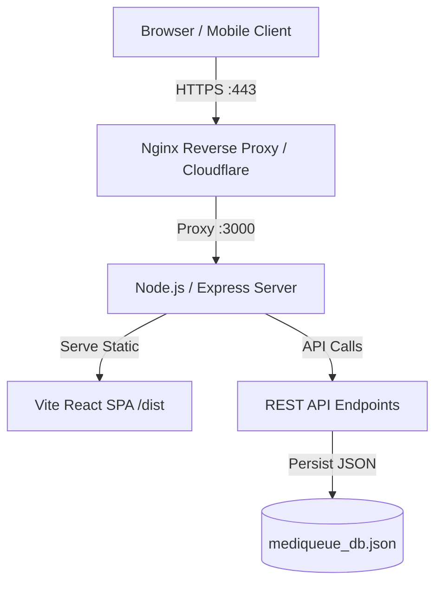
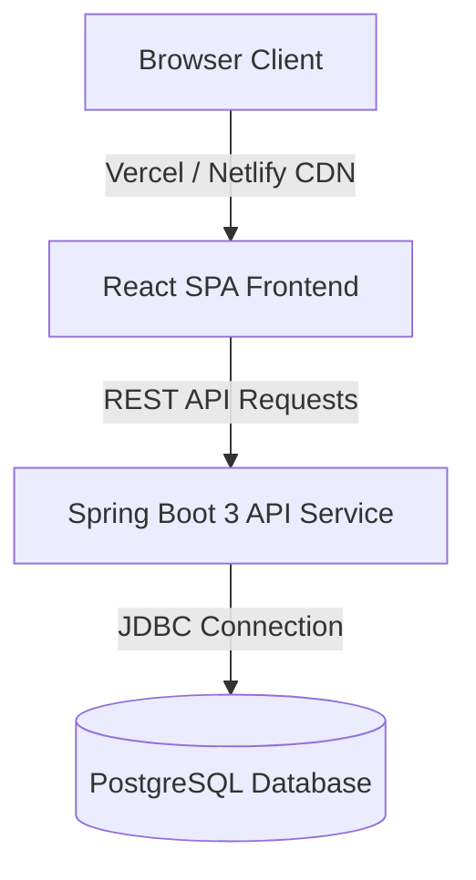

# MediQueue Production Deployment Plan

## Goal Description
Deploy **MediQueue** (Smart Patient Queue & Medicine Reminder System) into a production-ready environment. The plan covers containerization, multi-environment configurations, database provisioning, reverse-proxy setup, and step-by-step platform deployment (Render / Railway / AWS / Docker VPS).

---

## User Review Required

> [!IMPORTANT]
> **Architecture Selection**: MediQueue currently provides two backend options:
> 1. **Express Full-Stack Monolith (`server.ts`)**: Node.js/Express server that serves both REST APIs and bundled React SPA static assets with file-based JSON persistence (`mediqueue_db.json`). **(Fastest to deploy, zero database setup required)**.
> 2. **Spring Boot + PostgreSQL (`backend/` + `database/schema.sql`)**: Enterprise Java Spring Boot 3 API with dedicated PostgreSQL database. **(Recommended for production multi-user scale)**.

> [!WARNING]
> **Production Secrets & Environment Variables**: Ensure strong secrets are set prior to live deployment:
> - `JWT_SECRET`: Minimum 32-character random string (do not use default seed key).
> - `DATABASE_URL` / `DB_PASSWORD`: PostgreSQL connection credentials.
> - `NODE_ENV`: Set to `production`.

---

## Open Questions

> [!QUESTION]
> **Question 1**: Which deployment target do you prefer?
> - **Option A (Recommended for simplicity)**: Express Monolith deployed via Docker / Render / Railway / Docker VPS.
> - **Option B (Enterprise)**: Decoupled deployment with Spring Boot 3 backend on Render/AWS, PostgreSQL on Render/Neon/Supabase, and React SPA on Vercel/Netlify.
> - **Option C**: Single-server Docker Compose setup with PostgreSQL and Express/Spring Boot backend on a Cloud VPS (DigitalOcean / AWS EC2 / Hetzner).

---

## Architecture Diagrams

### 1. Express Full-Stack Monolith Architecture


### 2. Spring Boot + PostgreSQL Decoupled Architecture


---

## Proposed Changes

### Component 1: Docker Containerization for Express Monolith

#### [NEW] `Dockerfile`
Multi-stage Dockerfile to build the React static assets, bundle `server.ts`, and run the production server.

```dockerfile
# Stage 1: Build stage
FROM node:20-alpine AS builder

WORKDIR /app

# Copy package manifests and install dependencies
COPY package*.json ./
RUN npm ci

# Copy source code and configuration files
COPY . .

# Run build (Vite SPA + ESBuild server bundle)
RUN npm run build

# Stage 2: Production runtime stage
FROM node:20-alpine AS runner

WORKDIR /app

ENV NODE_ENV=production
ENV PORT=3000

# Copy package files and production dependencies only
COPY package*.json ./
RUN npm ci --omit=dev

# Copy built dist files from builder stage
COPY --from=builder /app/dist ./dist
COPY --from=builder /app/mediqueue_db.json ./mediqueue_db.json

# Expose port
EXPOSE 3000

# Health check endpoint verification
HEALTHCHECK --interval=30s --timeout=5s --start-period=5s --retries=3 \
  CMD wget --no-verbose --tries=1 --spider http://localhost:3000/api/health || exit 1

# Start production server
CMD ["node", "dist/server.cjs"]
```

#### [NEW] `.dockerignore`
```text
node_modules
dist
.git
.gitignore
.env
*.log
npm-debug.log*
yarn-debug.log*
yarn-error.log*
.DS_Store
```

---

### Component 2: Spring Boot Backend Containerization

#### [NEW] `backend/Dockerfile`
```dockerfile
# Stage 1: Build Java Application with Maven
FROM maven:3.9-eclipse-temurin-17 AS build
WORKDIR /app
COPY pom.xml .
RUN mvn dependency:go-offline -B
COPY src ./src
RUN mvn package -DskipTests

# Stage 2: Production JRE Runtime
FROM eclipse-temurin:17-jre-alpine
WORKDIR /app
COPY --from=build /app/target/*.jar app.jar
EXPOSE 8080
ENTRYPOINT ["java", "-jar", "app.jar"]
```

---

### Component 3: Multi-Container Orchestration (Docker Compose)

#### [NEW] `docker-compose.yml`
Orchestrates PostgreSQL database and full-stack MediQueue service for VPS or local production simulation.

```yaml
version: '3.8'

services:
  # Database Service (PostgreSQL)
  postgres:
    image: postgres:16-alpine
    container_name: mediqueue_postgres
    restart: always
    environment:
      POSTGRES_DB: mediqueue
      POSTGRES_USER: postgres
      POSTGRES_PASSWORD: ${DB_PASSWORD:-postgres_secure_password_2026}
    ports:
      - "5432:5432"
    volumes:
      - postgres_data:/var/lib/postgresql/data
      - ./database/schema.sql:/docker-entrypoint-initdb.d/schema.sql
    healthcheck:
      test: ["CMD-SHELL", "pg_isready -U postgres -d mediqueue"]
      interval: 10s
      timeout: 5s
      retries: 5

  # Express Full-Stack App
  app:
    build:
      context: .
      dockerfile: Dockerfile
    container_name: mediqueue_app
    restart: always
    ports:
      - "3000:3000"
    environment:
      - NODE_ENV=production
      - PORT=3000
      - JWT_SECRET=${JWT_SECRET:-mediqueue_jwt_secret_key_2026_super_secure_32bytes_min}
    volumes:
      - app_data:/app/data
    depends_on:
      postgres:
        condition: service_healthy

volumes:
  postgres_data:
  app_data:
```

---

### Component 4: Production Configuration & Health Check Endpoint

#### [MODIFY] `server.ts`
Add a dedicated `/api/health` monitoring endpoint to support cloud container health checks and uptime monitoring.

```typescript
// Health check endpoint for container orchestrators & load balancers
app.get('/api/health', (req, res) => {
  res.status(200).json({
    status: 'UP',
    timestamp: new Date().toISOString(),
    uptime: process.uptime(),
    service: 'MediQueue API'
  });
});
```

---

## Step-by-Step Deployment Guides

### Platform 1: Render / Railway (PaaS - Recommended for Zero-Downtime SaaS)
1. **Repository Setup**: Push project repository to GitHub / GitLab.
2. **Environment Variables**:
   - Add `NODE_ENV=production`
   - Add `JWT_SECRET` (Secure random string)
3. **Build Command**: `npm install && npm run build`
4. **Start Command**: `npm start` (Runs `node dist/server.cjs`)
5. **Auto-Deploy**: Enable continuous deployment on push to `main` branch.

### Platform 2: Docker / VPS Deployment (Ubuntu + Docker Compose)
1. SSH into cloud VPS instance.
2. Clone repository & copy production `.env`:
   ```bash
   git clone https://github.com/your-org/mediqueue.git
   cd mediqueue
   cp .env.example .env
   ```
3. Update `.env` with secure password & JWT secret.
4. Launch container stack:
   ```bash
   docker-compose up -d --build
   ```
5. Configure Nginx reverse proxy with SSL via Certbot:
   ```nginx
   server {
       server_name mediqueue.yourdomain.com;

       location / {
           proxy_pass http://localhost:3000;
           proxy_http_version 1.1;
           proxy_set_header Upgrade $http_upgrade;
           proxy_set_header Connection 'upgrade';
           proxy_set_header Host $host;
           proxy_cache_bypass $http_upgrade;
       }
   }
   ```

---

## Production Readiness Checklist

- [x] **Static & Server Build Verification**: Passed (`tsc --noEmit` & `vite build` cleanly bundled)
- [ ] **HTTPS / SSL Configuration**: Certificate configured via Cloudflare or Let's Encrypt Certbot
- [ ] **Database Backup Strategy**: Volume snapshot / automated `pg_dump` cron configured
- [ ] **JWT Security**: Secret changed from default string to 256-bit cryptographically secure key
- [ ] **CORS Security**: Restrict `Access-Control-Allow-Origin` to production app domain
- [ ] **Rate Limiting**: Rate limiter middleware added to protect authentication routes against brute force

---

## Verification Plan

### Automated Build Verification
Verify Docker build and bundle execution locally:
```bash
# 1. Typecheck and linting
npm run lint

# 2. Production build verification
npm run build

# 3. Docker build test
docker build -t mediqueue:latest .

# 4. Docker container spin-up & health check test
docker run -d -p 3000:3000 --name mediqueue_test mediqueue:latest
curl http://localhost:3000/api/health
docker stop mediqueue_test && docker rm mediqueue_test
```

### Manual Verification
1. Access `http://localhost:3000/` and verify landing page loads with modern UI.
2. Login with seed doctor account (`doctor@mediqueue.demo` / `Demo@123`).
3. Verify doctor live queue dashboard renders correctly.
4. Login with patient account (`patient@mediqueue.demo` / `Demo@123`).
5. Book an appointment and verify token generation (`A-XX`) & QR code rendering.
6. Verify medicine reminder audio/browser alert triggers cleanly.
